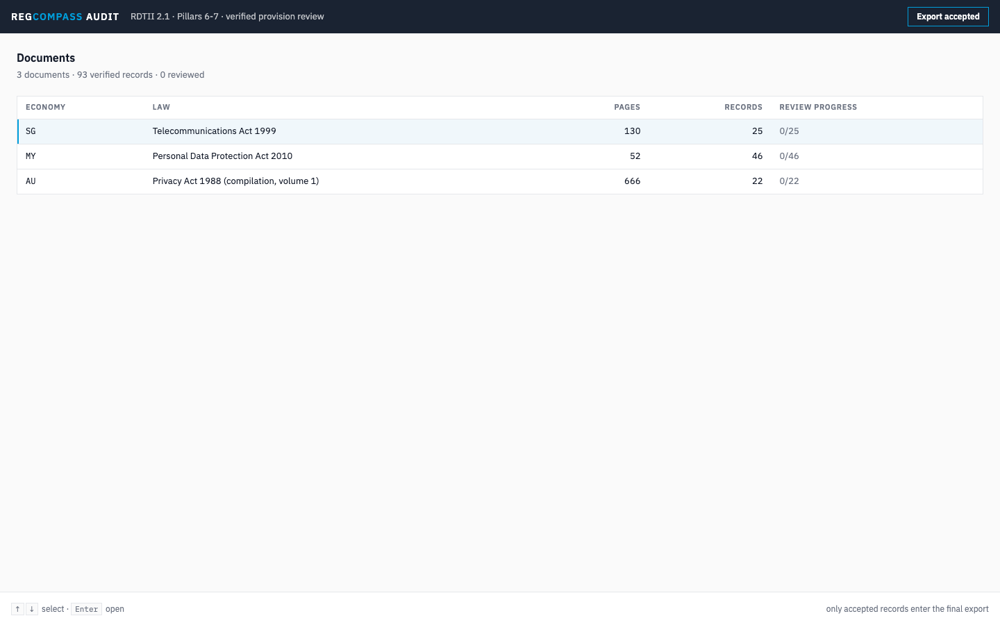
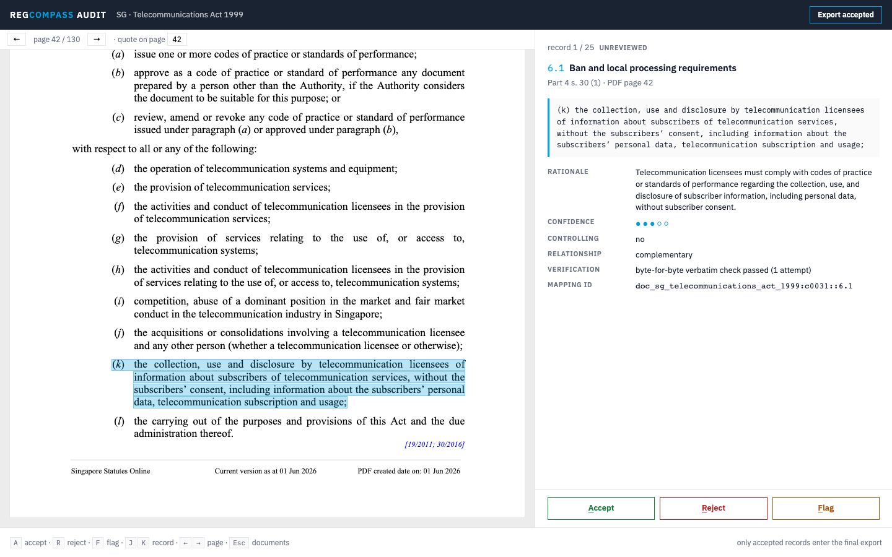
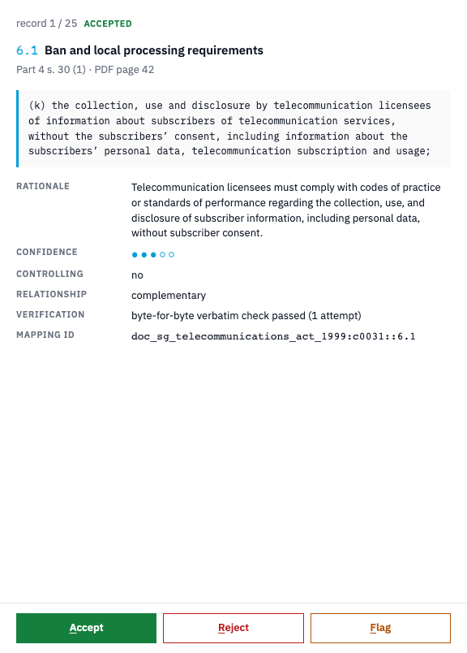
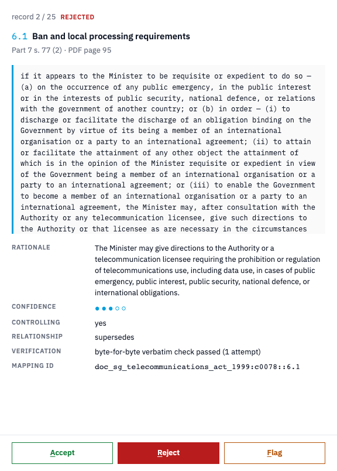
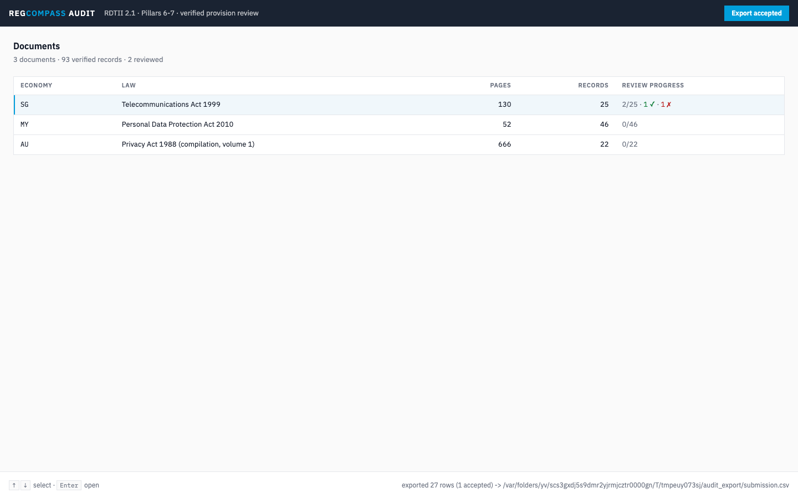
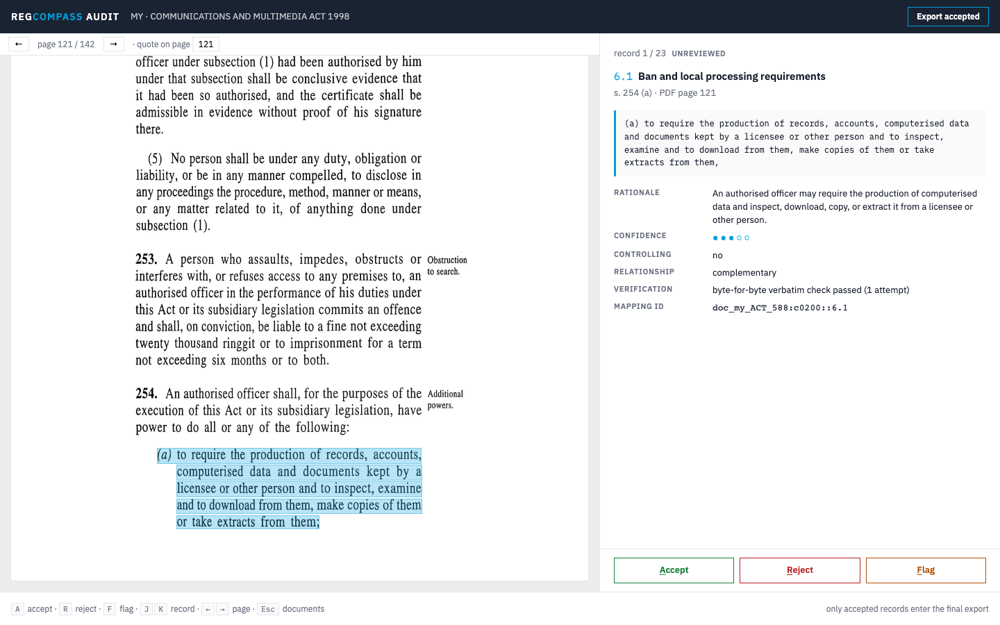

# The RegCompass audit view: a walkthrough

The audit view is where a human reviewer checks the Mappings against the source
PDFs and decides what ships. It enforces the core review rule: **only Mappings
a reviewer accepts enter the Evidence Export**. It is the Evidence screen of the
one interface (`docs/WEB_DEMO.md`), and everything below runs from a pip-only
install; the React bundle is pre-built and committed, so Node is never required.

Two data sources sit behind the same screens. The default is the WORKING
DATABASE, so a Run started from Start a Run is reviewable straight away:

```bash
uv run regcompass serve
```

The other is a FROZEN BUNDLE, which needs neither a key nor a Run:

```bash
# the committed demo bundle (3 fixture acts, 93 verified records)
uv run regcompass serve --bundle audit_bundle

# or the full corpus after a reproduction run (966 records across the 43
# documents that yielded verified rows, of the 49 crawled)
uv run python scripts/make_audit_bundle.py repro
uv run regcompass serve --bundle data/repro/audit_bundle
```

Then open http://127.0.0.1:8000. Review Decisions persist in the WORKING
DATABASE, in the `reviews` table, keyed by (Run, Mapping), so you can stop and
resume any time and a second Run never inherits the first Run's decisions. The
frozen bundle lane (`--bundle`) is read only: it has no Run to attach a
decision to, so posting one there answers 409. On the working-database lane the audit read
endpoints (the Documents, the records of one Document, the stored file, one record in full, and
the Review queue) take an optional `run_id`; without one they show the newest completed Run.

## 1. The document list



The landing view is a dense table: one row per source document, with its
economy, page count, number of verified records, and review progress. The
subtitle tallies the whole bundle. Documents whose canonical text came from
OCR carry an `OCR` badge after the title. (The committed 3-act demo bundle
is all born-digital; the OCR badge and lane appear when serving a
full-corpus reproduction bundle, which includes the scanned Malaysian
gazettes.)

The whole UI is keyboard-first: `↑`/`↓` move the row focus (the blue inset
bar on the left edge), `Enter` opens the focused document. The bottom bar
always shows the keys that work on the current screen.

Beside it is the **Review queue**, the same Run listed the other way round:
every record in one list, lowest Confidence first, whichever Document it sits
in, with the Document, the provision, the Indicator, the Confidence and the
decision on each row. A count line states how many rows sit below the
calibration threshold and how many carry no decision yet, and **Unreviewed
only** hides the ones that do. A row the pipeline could not score reads `not
scored`: it sorts first and counts as below the threshold, because nothing is
known about it. Opening a row lands in the same audit view, and the decision
and stepping keys then follow queue order.

## 2. The audit view: source left, record right



Opening a document lands on its first record in a 60/40 split (below 720px the
two panes stack, so the screen also works on a phone):

- **Left (60%): the source PDF itself**, rendered by PDF.js. The verbatim
  quote is highlighted in UN blue, and the view auto-scrolls to it. The
  highlight is not a text search: the rectangles are computed from the
  pipeline's own word coordinates (pdfplumber for born-digital pages,
  Tesseract for scanned ones), anchored to the exact character offsets where
  the byte-for-byte verification passed. What you see highlighted is
  literally the evidence the pipeline verified.
- **Right (40%): the structured record.** From top to bottom: position in
  the review queue and current review state; the indicator (`6.1` and its
  name); the provision reference (Part/section plus the PDF page); the
  verbatim quote in monospace with the blue stripe (reflowed for reading,
  the underlying bytes are untouched); then the metadata grid: the mapper's
  rationale, the mechanical confidence composite as filled/hollow dots
  (never LLM self-reported), whether this record is the controlling evidence
  for its group, its relationship to the group, the verification statement
  with the attempt count, and the mapping ID for traceability.

The toolbar above the PDF shows the current page and, when the quote spans
pages, one button per page it appears on. `←`/`→` turn pages manually.

## 3. Reviewing: Accept / Reject / Flag



Three decisions, three keys: `A` accept, `R` reject, `F` flag (for records
that need a second look). The buttons at the bottom do the same by mouse;
the decision a Mapping carries is marked on its button and in the pill at the
top of the pane ("Accepted", "Rejected", "Flagged" or "Not reviewed"), each
with its own shape, so it never rests on colour alone. After a decision the view advances to the
next unreviewed record automatically, so a full document review is just
reading and pressing one key per record. `J`/`K` move through records
manually; `Esc` returns to the document list.

The **Note** field above the three buttons travels with the decision: type
why you accept, reject or flag this Mapping and press the key, and the note
is stored with it and shown again whenever the record comes back. While the
cursor is in that field the letter keys type, they do not decide.



Decisions are never destructive: a rejected record stays in the working data
and its decision stays with it, in the working database, keyed by (Run,
Mapping). There is one decision per Mapping per Run: change your mind by
pressing a different key on the same record and the new decision, with its
note and its time, replaces the old one.

## 4. Progress at a glance


Back on the document list, each Document's Review column shows a bar split
by decision and the same tally in words: "2 of 25 reviewed", then the
accepted, rejected and flagged counts, each beside its shape. Counts appear
only when they are nonzero, so an untouched Document stays quiet grey.

Above the list, the export summary says how many proven Mappings will go into
the Evidence Export and counts the rest. "Accept all N…" accepts every
Mapping not reviewed yet, but only after it asks: it names the count, Cancel
(or Esc) leaves everything as it was, and decisions already taken are never
overwritten.

## 5. Export: the review gate



**Export workbook** (top right) runs the real M9 export over the reviewed
bundle: the same 13-column submission CSV (plus the final round's Language
of Source column), the organizers' own filled workbook beside it, the gate
battery, and the supplementary JSON, with one addition: the review gate. Only records with
an accepted review enter the export; rejected, flagged, and unreviewed
records are all excluded. An indicator that loses every record earns an
explicit "No provision found" row, never silence, and the supplementary
JSON records the gate counts (verified / accepted / rejected / flagged /
unreviewed).

The bottom bar reports the result: here, 27 rows = 1 accepted substantive
row plus 26 earned zeros across the three economies. If the gate battery
goes red, nothing ships and the failures are reported instead.

## 6. The OCR lane



Scanned legislation works the same way. This is Malaysia's Communications
and Multimedia Act 1998, a scanned PDF whose canonical text came from
Tesseract: the highlight rectangles derive from the OCR word boxes
(converted to PDF points at extraction time), so the overlay sits on the
scanned image exactly where the verified quote lives.

## Where things live

| Piece | Location |
|---|---|
| Backend (both data sources, highlight geometry) | `src/regcompass/audit.py` |
| The server (API and the mounted interface) | `src/regcompass/server.py` |
| Review persistence | `review_set` / `reviews_for_run` / `review_counts` in `src/regcompass/storage.py` |
| Review gate | `export_all(reviews=...)` in `src/regcompass/export.py` |
| Frontend source | `ui/` (Vite + React + TypeScript + pdfjs-dist) |
| Committed bundle served to judges | `src/regcompass/ui_dist/` |
| Demo bundle manifest | `audit_bundle/manifest.json` (golden pipeline outputs + fixture PDFs) |
| Word boxes behind a working-database highlight | `document_words`, written at ingest |
| Bundle builder (fixtures / full repro corpus) | `scripts/make_audit_bundle.py` |
| End-to-end regression (keyboard flow) | `scripts/u0_e2e.py` |

Design direction: Swiss International Typographic
Style; IBM Plex Sans and IBM Plex Mono, self-hosted; `#FAFAFA` field, slate
`#1A2332` bars, a single UN-blue accent `#009EDB`; semantic colours only for
the three review actions; 1px rules, no shadows; fixed 48px top and bottom
bars; dense tables, not cards.
